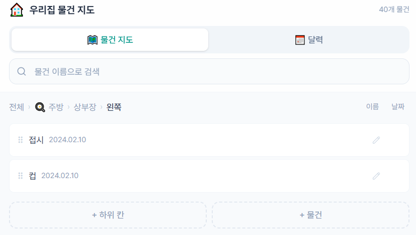
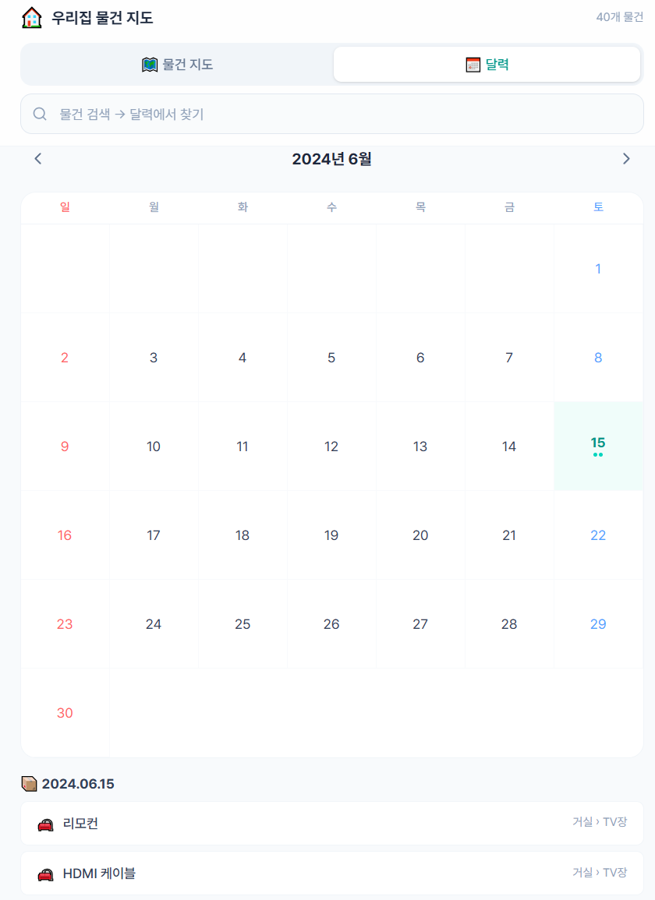

# 🏠 우리집 물건 지도 (Home Inventory)

집 안 물건의 위치를 **방 → 가구 → 칸 → 물건** 구조로 정리하고, 평면도에서 한눈에 찾을 수 있는 웹앱입니다.
가족이 같은 주소로 접속하면 실시간으로 데이터가 공유됩니다.

> 💡 **이런 분께 추천:** 물건을 자주 잃어버리는 가족, 이사·정리 후 위치 기록, 창고·공방 재고 관리 등

---

## 📸 스크린샷


| 물건 지도(평면도) | 보관소 내부 | 달력 |
|:--:|:--:|:--:|
|  |  |  |
---
---

## 주요 기능

- 🗺️ **평면도** — 집 구조와 방 내부 가구를 드래그로 배치
- 📂 **무한 하위 칸** — 가구 → 칸 → 더 작은 칸, 원하는 만큼 중첩
- 🔎 **검색** — 물건 이름으로 위치 즉시 확인 (자동완성)
- 📅 **달력** — 구매/보관 날짜별 물건 조회
- 🔄 **실시간 공유** — Firebase Firestore 기반 동기화
- 💾 **백업** — JSON 내보내기/가져오기

---

## 설치 및 실행

### 사전 준비

- [Node.js LTS](https://nodejs.org) 설치
- Google 계정 (Firebase용)

### 1. 코드 받기

```bash
git clone https://github.com/JAEWONKIM95/home-inventory.git
cd home-inventory
npm install
```

Git이 없으면 GitHub에서 **Code → Download ZIP** 후 압축 풀고 해당 폴더에서 `npm install`

### 2. Firebase 프로젝트 생성

1. [Firebase 콘솔](https://console.firebase.google.com/)에서 프로젝트 만들기
2. 웹 앱 등록 (`</>` 아이콘) → `firebaseConfig` 값 확인
3. **Firestore Database** 만들기 (위치: `asia-northeast3` 서울 권장)
4. Firestore **규칙(Rules)** 탭에서 아래 내용으로 교체 후 게시:

```
rules_version = '2';
service cloud.firestore {
  match /databases/{database}/documents {
    match /inventory/shared {
      allow read, write: if true;
    }
  }
}
```

### 3. 환경 설정

```bash
# Windows
Copy-Item .env.example .env

# Mac / Linux
cp .env.example .env
```

`.env` 파일을 열고 Firebase 설정값 입력:

| firebaseConfig | .env |
|---|---|
| `apiKey` | `VITE_FIREBASE_API_KEY` |
| `authDomain` | `VITE_FIREBASE_AUTH_DOMAIN` |
| `projectId` | `VITE_FIREBASE_PROJECT_ID` |
| `storageBucket` | `VITE_FIREBASE_STORAGE_BUCKET` |
| `messagingSenderId` | `VITE_FIREBASE_MESSAGING_SENDER_ID` |
| `appId` | `VITE_FIREBASE_APP_ID` |
| `measurementId` | `VITE_FIREBASE_MEASUREMENT_ID` |

### 4. 로컬 실행

```bash
npm run dev
```

`http://localhost:5173` 에서 앱 확인

### 5. 배포 (가족 공유)

```bash
npm install -g firebase-tools
firebase login
firebase use --add          # 본인 Firebase 프로젝트 선택
npm run build
firebase deploy
```

배포 후 `https://<프로젝트이름>.web.app` 주소를 가족에게 공유

---

## 문제 해결

| 증상 | 해결 |
|---|---|
| 화면이 비어있음 / 권한 오류 | `.env` 파일 확인, Firestore 규칙 게시 여부 확인 |
| `firebase` 명령 인식 안 됨 | `npm install -g firebase-tools` 실행 후 터미널 재시작 |
| `node` / `npm` 인식 안 됨 | Node.js 설치 후 터미널 새로 열기 |
| Windows 스크립트 실행 오류 | `Set-ExecutionPolicy -Scope CurrentUser -ExecutionPolicy RemoteSigned` |

---

## 보안

기본 Firestore 규칙은 `inventory/shared` 문서에 대해 열린 읽기/쓰기를 허용합니다. **신뢰할 수 있는 사람끼리 비공개로 사용하는 전제**입니다.

공개 서비스로 전환하려면 Firebase Authentication을 활성화하고 규칙을 `allow read, write: if request.auth != null;`으로 변경하세요.

---

## 명령어

| 명령 | 설명 |
|---|---|
| `npm install` | 의존성 설치 |
| `npm run dev` | 개발 서버 실행 |
| `npm run build` | 배포용 빌드 (`dist/`) |
| `npm run preview` | 빌드 결과 미리보기 |

**기술 스택:** Vite · React 18 · Tailwind CSS v4 · Firebase Firestore

## License

[MIT](LICENSE)
